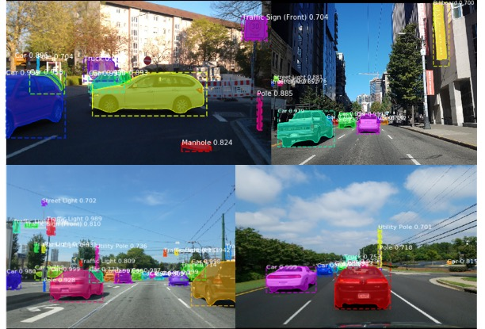

# Mask R-CNN Application in Driving Scenes 
One of the major challenges in autonomous driving is the ability to understand the environment including surrounding vehicles, traffic signs, and pedestrians at a finer-grained level. In this project, we investigate and evaluate the performance of the state-of-the-art model for instance segmentation, Mask R-CNN, on the newly-released Mapillary dataset, whose images focus specifically on driving scenes. We transfer the learning results from the pre-trained weights, fine tune the final layers for Mapillary Datasets. The result shows a significant improvement in precision measurements from the baseline, and achieves at a surpassing performance than benchmarks.

: 

# Getting Started
* [demo.ipynb](/demo.ipynb) Is the easiest way to start. It shows an example of using a model pre-trained on MS COCO to segment objects in your own images.
It includes code to run object detection and instance segmentation on arbitrary images.

* [train_shapes.ipynb](train_shapes.ipynb) shows how to train Mask R-CNN on your own dataset. This notebook introduces a toy dataset (Shapes) to demonstrate training on a new dataset.

* ([model.py](model.py), [utils.py](utils.py), [config.py](config.py)): These files contain the main Mask RCNN implementation. 

* [inspect_data.ipynb](/inspect_data.ipynb). This notebook visualizes the different pre-processing steps
to prepare the training data.

* [inspect_model.ipynb](/inspect_model.ipynb) This notebook goes in depth into the steps performed to detect and segment objects. It provides visualizations of every step of the pipeline.

* [inspect_weights.ipynb](/inspect_weights.ipynb)
This notebooks inspects the weights of a trained model and looks for anomalies and odd patterns.

# Step by Step Detection
To help with debugging and understanding the model, there are 3 notebooks 
([inspect_data.ipynb](inspect_data.ipynb), [inspect_model.ipynb](inspect_model.ipynb),
[inspect_weights.ipynb](inspect_weights.ipynb)) that provide a lot of visualizations and allow running the model step by step to inspect the output at each point. Here are a few examples:

## Differences from the Official Paper
This implementation follows the Mask RCNN paper for the most part, but there are a few cases where we deviated in favor of code simplicity and generalization. These are some of the differences we're aware of. If you encounter other differences, please do let us know.

* **Image Resizing:** To support training multiple images per batch we resize all images to the same size. For example, 1024x1024px on MS COCO. We preserve the aspect ratio, so if an image is not square we pad it with zeros. In the paper the resizing is done such that the smallest side is 800px and the largest is trimmed at 1000px.
* **Bounding Boxes**: Some datasets provide bounding boxes and some provide masks only. To support training on multiple datasets we opted to ignore the bounding boxes that come with the dataset and generate them on the fly instead. We pick the smallest box that encapsulates all the pixels of the mask as the bounding box. This simplifies the implementation and also makes it easy to apply certain image augmentations that would otherwise be really hard to apply to bounding boxes, such as image rotation.

    To validate this approach, we compared our computed bounding boxes to those provided by the COCO dataset.
We found that ~2% of bounding boxes differed by 1px or more, ~0.05% differed by 5px or more, 
and only 0.01% differed by 10px or more.

* **Learning Rate:** The paper uses a learning rate of 0.02, but we found that to be
too high, and often causes the weights to explode, especially when using a small batch
size. It might be related to differences between how Caffe and TensorFlow compute 
gradients (sum vs mean across batches and GPUs). Or, maybe the official model uses gradient
clipping to avoid this issue. We do use gradient clipping, but don't set it too aggressively.
We found that smaller learning rates converge faster anyway so we go with that.

* **Anchor Strides:** The lowest level of the pyramid has a stride of 4px relative to the image, so anchors are created at every 4 pixel intervals. To reduce computation and memory load we adopt an anchor stride of 2, which cuts the number of anchors by 4 and doesn't have a significant effect on accuracy.

## Requirements
* Python 3.4+
* TensorFlow 1.3+
* Keras 2.0.8+
* Jupyter Notebook
* Numpy, skimage, scipy, Pillow, cython, h5py
